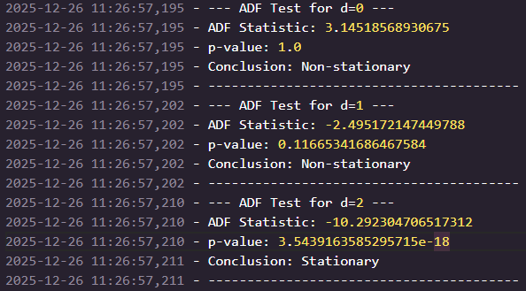

# Phân Tích và Dự Báo Doanh Số Bán Lẻ (ARIMA vs SARIMA)
Dự án này tập trung vào việc xây dựng mô hình thống kê để dự báo doanh số bán lẻ hàng tháng. Trọng tâm của nghiên cứu là quy trình xử lý chuỗi thời gian không dừng, có xu hướng tăng trưởng mạnh và tính mùa vụ rõ rệt.
## Công Nghệ Sử Dụng
- Ngôn ngữ: Python 

- Thư viện chính: statsmodels (ARIMA/SARIMA), pandas, numpy, matplotlib.
## Quy Trình Thực Hiện Chi Tiết
1. Phân Tích Tính Dừng (Stationarity Analysis)
    Việc kiểm định tính dừng là bắt buộc để đảm bảo các tham số thống kê của chuỗi không thay đổi theo thời gian.
    - Kết quả kiểm định ADF:
    
        - Bậc 0 ($d=0$): $p$-value = 1.0 (Không dừng).
        - Bậc 1 ($d=1$): $p$-value = 0.116 (Không dừng).
        - Bậc 2 ($d=2$): $p$-value = $3.54 \times 10^{-18}$ (Dừng hoàn toàn).
    - Quyết định: Áp dụng sai phân bậc 2 ($d=2$) để triệt tiêu xu hướng3.